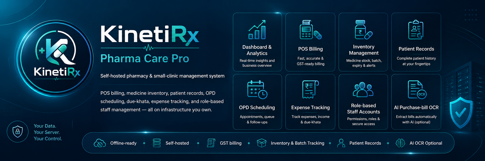
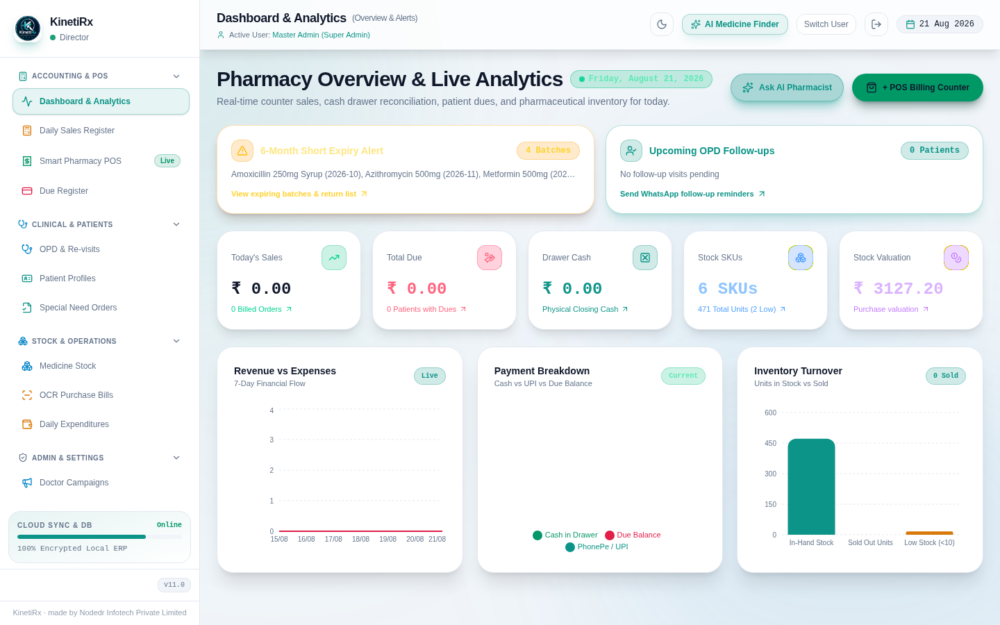
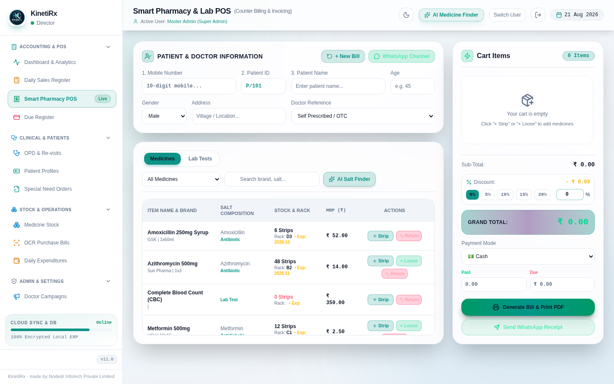
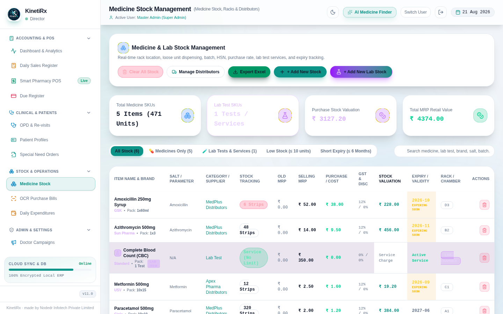
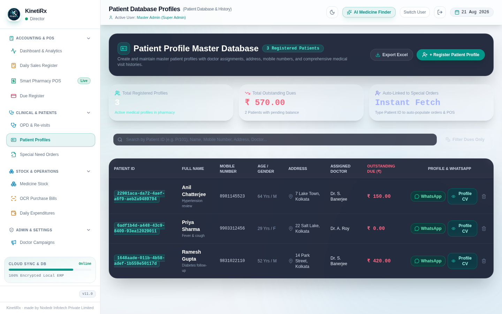
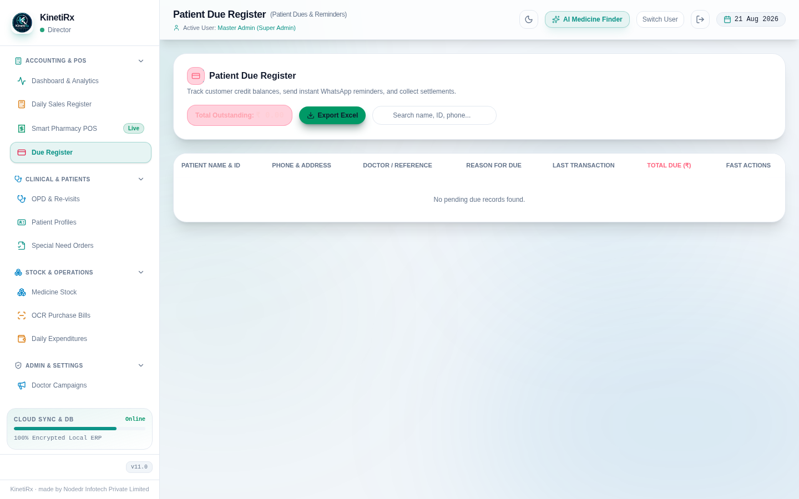

<p align="center">
  
</p>

<h1 align="center">KinetiRx</h1>

<p align="center"><strong>Pharma Care Pro</strong> — a self-hosted pharmacy &amp; small-clinic management system.</p>

<p align="center">
  
</p>

<p align="center">
  
  
  
  
  
</p>

<p align="center">
  <a href="https://kinetirx.nodedr.com">Website</a> ·
  <a href="backend/API.md">API Docs</a> ·
  <a href="https://github.com/Raktim94/KinetiRx/wiki">Wiki</a> ·
  <a href="https://github.com/Raktim94/KinetiRx/issues">Report an Issue</a>
</p>

---

KinetiRx runs your pharmacy's day-to-day operations — point-of-sale billing,
medicine inventory, patient records, OPD scheduling, a due-khata (credit
ledger), daily cash-drawer reconciliation, expense tracking, and role-based
staff accounts — on a Postgres database you own, on hardware you control. No
subscription, no third-party SaaS dependency for core operations. Optional
Gemini AI integration adds purchase-bill OCR scanning and a clinical
assistant when you supply an API key; without one, the app runs fully
offline in fallback mode.

Built for independent pharmacies and small clinics that want a real,
auditable system of record instead of a spreadsheet — and that would rather
self-host than hand patient and financial data to a SaaS vendor.

## Table of contents

- [Features](#features)
- [Screenshots](#screenshots)
- [Tech stack](#tech-stack)
- [Quick start (Docker Compose)](#quick-start-docker-compose)
- [Self-hosting on CasaOS / ZimaOS](#self-hosting-on-casaos--zimaos)
- [Development setup](#development-setup)
- [Environment variables](#environment-variables)
- [Architecture](#architecture)
- [MCP server (AI assistant integration)](#mcp-server-ai-assistant-integration)
- [Security notes](#security-notes)
- [Documentation](#documentation)
- [License](#license)

## Features

- **Dashboard** — daily/period overview and analytics: today's sales, total dues, drawer cash, stock valuation, revenue-vs-expense and inventory-turnover charts
- **Daily Sales** — sales register with cash-drawer reconciliation (opening cash, denominations, cash/UPI/card split, closing difference)
- **POS** — point-of-sale billing with GST invoicing, strip/loose dispensing, discounts, and mixed payment modes (cash, UPI, card, due, partial)
- **Due-Khata** — patient credit ledger (dues, payment history, WhatsApp reminders)
- **Medicine Orders** — track medicines needed/ordered from distributors
- **Inventory** — medicine & lab-test stock, batch/expiry tracking, rack location, distributor tracking, low-stock and short-expiry alerts
- **Inward OCR** — AI-powered purchase-bill scanning (Gemini) that extracts line items straight into inventory
- **OPD** — outpatient visit scheduling and follow-up reminders
- **Patients** — patient records, visit history, purchase history, blood-test tracking
- **Expenses** — day-to-day expense logging by category
- **Business Development** — doctor outreach / marketing campaigns and worksheet tasks
- **Employee Management** — role-based staff accounts with per-tab permissions
- **Invoice Settings** — store letterhead, GST/DL numbers, invoice retention policy, printer config
- **System Reset** — administrative data-reset tooling with a 5-day rolling backup

Every route above (except health check and login) requires a valid JWT and
is authorized server-side against the employee's role/permissions — there is
no client-side-only access control.

## Screenshots

| Dashboard | Smart Pharmacy POS |
|---|---|
|  |  |

| Medicine Stock Management | Patient Database Profiles |
|---|---|
|  |  |

| Due Register (Due-Khata) |
|---|
|  |

## Tech stack

| Layer | Stack |
|---|---|
| Backend | Go + [Gin](https://gin-gonic.com/), PostgreSQL, JWT auth, bcrypt password hashing |
| Frontend | React 19 + Vite + TypeScript + Tailwind CSS v4, dark/light mode |
| AI | Google Gemini (`gemini-3.7-flash`) for invoice OCR and a clinical assistant — optional, degrades to offline fallback if unconfigured |
| Deployment | Docker Compose (Postgres + backend + nginx-served SPA); one-click install via the CasaOS/ZimaOS App Store |
| AI tooling | Optional MCP (Model Context Protocol) server — lets Claude or any MCP-aware assistant operate a running KinetiRx instance through tool calls |

## Quick start (Docker Compose)

```bash
git clone https://github.com/Raktim94/KinetiRx.git
cd KinetiRx

cp deploy/.env.example deploy/.env
# Edit deploy/.env and set at minimum:
#   POSTGRES_PASSWORD
#   JWT_SECRET              (openssl rand -hex 32)
#   KINETIRX_ADMIN_PASSWORD (used only on first boot, to seed the admin account)
#   GEMINI_API_KEY          (optional — enables AI OCR + assistant)

docker compose -f deploy/docker-compose.yml --env-file deploy/.env up -d --build
```

Open **http://localhost:3080** in a browser. Log in with employee ID
`EMP-ADMIN-1` and the `KINETIRX_ADMIN_PASSWORD` you set — there is no
password-reset flow yet, so keep it safe.

The backend API is also published directly on **http://localhost:8080**
(for curl/health checks/admin scripts); the browser SPA never needs this
since nginx proxies `/api/*` internally. Postgres itself is not published to
the host by default.

## Self-hosting on CasaOS / ZimaOS

KinetiRx ships a ready-to-use [`deploy/casaos-manifest.yml`](deploy/casaos-manifest.yml)
(x-casaos v2 compose-extension spec) for one-click installation from the
CasaOS/ZimaOS App Store, plus the icon, thumbnail, and screenshots the store
listing needs (all under [`deploy/`](deploy/)).

**What it installs:** Postgres + the KinetiRx backend + the nginx-served
frontend, wired together on an internal Docker network, with persistent
storage under `/DATA/AppData/$AppID`. The Postgres password, JWT secret, and
admin password ship with real default values in the manifest — CasaOS has no
mechanism to auto-generate them at install time (verified against 189 real
apps in the official store: none use anything like that). **Change all
three before using this beyond a local trial** — the install prompt
(`tips.before_install`) says so, and each field's own description repeats
it.

- **Status:** published — the backend/frontend images are built and pushed
  (multi-arch: `amd64`, `arm64`) to `ghcr.io/raktim94/kinetirx-backend` and
  `kinetirx-frontend` (tag `1.0.0`), and the manifest is submitted as a PR
  to [`IceWhaleTech/CasaOS-AppStore`](https://github.com/IceWhaleTech/CasaOS-AppStore)
  (`Apps/KinetiRx/`). Not merged into the official store index yet — PR
  review can take anywhere from about a day to several weeks.
- **Installing today, before the PR merges:** CasaOS's "Custom
  Install" / import-a-compose-file feature accepts
  `deploy/casaos-manifest.yml` directly — paste its contents in, confirm the
  pre-filled WebUI port/volume/env fields (pulled from the `x-casaos`
  block), and install.
- Category: `Productivity` · Architectures: `amd64`, `arm64` · App ID:
  `com.nodedr.kinetirx`.

## Development setup

Requires Go 1.26+, Node.js, and a local Postgres instance (or run
`docker compose -f deploy/docker-compose.yml up postgres` for just the DB).

**Backend:**
```bash
cd backend
cp .env.example .env   # set DATABASE_URL, JWT_SECRET, KINETIRX_ADMIN_PASSWORD
go run ./cmd/server
```
Runs on `:8080` by default; migrations in `backend/migrations/` run automatically on start.

**Frontend:**
```bash
cd frontend
cp .env.example .env   # optional — defaults to http://localhost:8080 if unset
npm install
npm run dev             # Vite dev server, http://localhost:5173
```
Other scripts: `npm run build` (production build), `npm run preview` (serve the build), `npm run lint` (`tsc --noEmit`).

## Environment variables

### Backend (`backend/.env.example`)

| Variable | Required | Default | Purpose |
|---|---|---|---|
| `DATABASE_URL` | yes | — | Postgres connection string |
| `JWT_SECRET` | yes | — | Signs JWT access tokens; min 16 chars enforced at startup, use 32+ random bytes |
| `KINETIRX_ADMIN_PASSWORD` | first boot only | — | Plaintext password for the seeded "Master Admin" account (`EMP-ADMIN-1`); bcrypt-hashed on first boot, never read again once the employees table has a row |
| `GEMINI_API_KEY` | no | unset | Enables AI OCR (`/api/ocr/parse-bill`) and the clinical assistant (`/api/ai/ask`); both degrade to a fallback response when unset |
| `PORT` | no | `8080` | Backend listen port |
| `GIN_MODE` | no | `release` | Gin mode (`debug`/`release`) |
| `ALLOWED_ORIGINS` | no | `http://localhost:5173,http://localhost:3000` | CORS allow-list for direct (non-proxied) browser access |

### Frontend (`frontend/.env.example`)

| Variable | Required | Default | Purpose |
|---|---|---|---|
| `VITE_API_URL` | no | `http://localhost:8080` (code default) | Base URL of the backend API; only needed when the backend isn't at the default local port |

### Deploy (`deploy/.env.example`) — Compose-level, in addition to the above

| Variable | Required | Default | Purpose |
|---|---|---|---|
| `POSTGRES_USER` | no | `kinetirx` | Postgres role |
| `POSTGRES_PASSWORD` | yes | — | Postgres password |
| `POSTGRES_DB` | no | `kinetirx` | Postgres database name |
| `HTTP_PORT` | no | `3080` | Host port for the frontend (the app you visit) |
| `BACKEND_PORT` | no | `8080` | Host port for direct backend access |

Secrets are never committed — `.env` files are gitignored; only the
`.env.example` templates are tracked.

## Architecture

```
┌─────────────┐        ┌──────────────────┐        ┌─────────────┐
│   Browser   │──HTTP─▶│  frontend (nginx) │──/api─▶│   backend   │──▶  PostgreSQL
│   (React    │        │  serves the SPA,  │        │  (Go + Gin, │      (data of
│   19 SPA)   │◀───────│  reverse-proxies  │◀───────│  JWT auth)  │       record)
└─────────────┘        │  /api/* same-     │        └──────┬──────┘
                        │  origin           │               │
                        └──────────────────┘               ▼
                                                     Google Gemini
                                                (optional — OCR + AI assistant,
                                                 falls back offline if unset)
```

The frontend never talks to the backend cross-origin in production: nginx
proxies `/api/*` to the backend container over the internal Compose network,
so the browser only ever sees one origin. The backend is the sole source of
truth for authorization — every route (bar health-check and login) checks
the caller's JWT and role/permissions server-side, regardless of what the
SPA renders.

## MCP server (AI assistant integration)

`mcp-server/` is a [Model Context Protocol](https://modelcontextprotocol.io)
server that lets an MCP-aware AI assistant (Claude Desktop, Claude Code,
etc.) operate a running KinetiRx instance through tool calls — inventory
lookup, patient/due-khata lookup, daily register, recording sales/expenses,
and more. See [`mcp-server/README.md`](mcp-server/README.md) for the full
tool list and a ready-to-paste client config. It's gated behind the `mcp`
Compose profile (not part of the always-on stack) since it speaks MCP over
stdio, not a network port:

```bash
docker compose -f deploy/docker-compose.yml --env-file deploy/.env \
  --profile mcp run --rm -T mcp-server
```

## Security notes

- Passwords are bcrypt-hashed; nothing sensitive is logged.
- JWT access tokens are the only auth mechanism — every non-public route is
  authorized server-side against the caller's role/permissions.
- Postgres is never published to the host in the Docker Compose or CasaOS
  deployment paths — only reachable from other containers on the same
  Compose network.
- There is currently no password-reset flow for the seeded admin account —
  store `KINETIRX_ADMIN_PASSWORD` somewhere safe before first boot.

## Documentation

- Full REST API contract: [`backend/API.md`](backend/API.md)
- Deeper guides (architecture, deployment troubleshooting, contributor setup, MCP server): see the [GitHub Wiki](https://github.com/Raktim94/KinetiRx/wiki)

## License

No license file is currently included in this repository — all rights
reserved by default until one is added. Contact the maintainer before reuse
or redistribution.

---

<p align="center">
  <sub>
    
    KinetiRx · made by
    <a href="https://www.nodedr.com">Nodedr Infotech Private Limited</a>
    · <a href="https://kinetirx.nodedr.com">kinetirx.nodedr.com</a>
  </sub>
</p>
